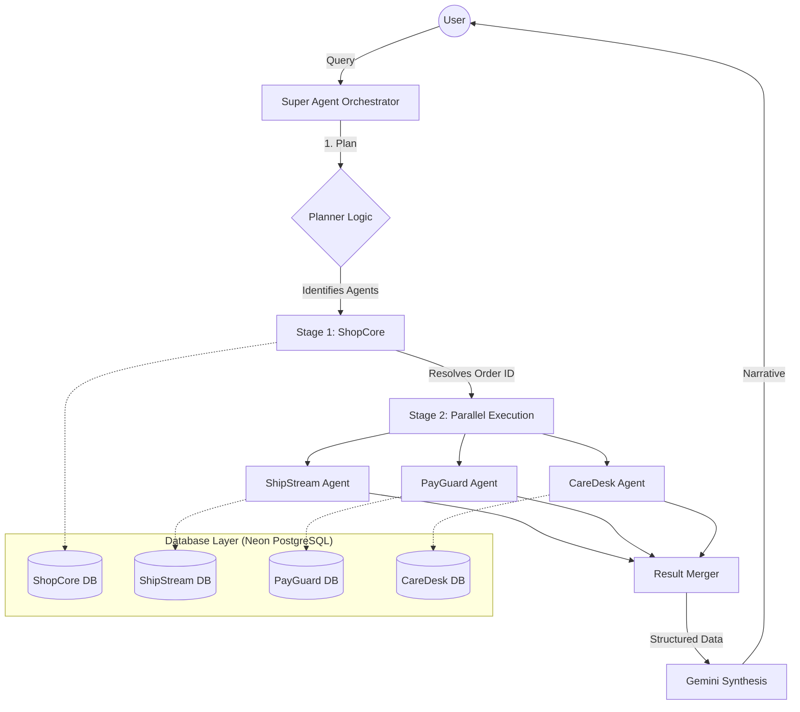

# 🤖 Omni-Retail Multi-Agent Orchestrator

A high-performance, voice-enabled multi-agent support system designed for modern e-commerce. This platform uses a specialized **Planner-Orchestrator** architecture to handle complex user queries across multiple domains including order tracking, payment processing, and customer support.

---

## 🏗️ System Architecture

The project follows a **Multi-Agent Orchestration** pattern inspired by LangGraph principles, but optimized for deterministic transactional data.

### 🔄 Workflow Logic
When a user asks a question, the **Super Agent** acts as the high-level brain:
1.  **Analyze (Planner)**: Deconstructs the query to identify which specialized sub-agents (ShopCore, ShipStream, PayGuard, CareDesk) are needed.
2.  **Execute (Parallel stages)**: Runs agents in parallel where possible. For example, it can fetch tracking details and payment status simultaneously if the Order ID is already known.
3.  **Synthesis (Merger)**: Collects raw structured data from all agents and uses **Gemini 2.0 Flash** to weave a human-like narrative response.



---

## 🧠 Technical Deep-Dive

### 🛡️ Why Text-to-SQL instead of Embeddings/RAG?
For this specific project, we chose a **Deterministic Text-to-SQL** approach over a pure Vector/Embedding approach for several critical reasons:

1.  **Transactional Accuracy**: E-commerce data (order statuses, wallet balances, tracking numbers) requires 100% precision. Embeddings are probabilistic and can "hallucinate" similar-sounding but incorrect IDs.
2.  **Transitive Relations**: SQL allows us to perform complex JOINs across tables (e.g., Finding a Wallet ID via an Order ID by bridging through Transactions). This is highly efficient and difficult to achieve with flat vector lookups.
3.  **Real-Time Data**: Transactional databases update constantly. Maintaining a vector index in sync with millions of order updates is computationally expensive; direct SQL queries are instantaneous and always fresh.

### 🛠️ Tech Stack & Library Usage

| Module | Technology | Why we use it |
| :--- | :--- | :--- |
| **Backend** | FastAPI | Asynchronous performance and built-in WebSocket support for real-time voice/chat. |
| **Orchestrator** | Python / Asyncio | Handles the concurrent execution of multiple sub-agents without blocking the main thread. |
| **LLM** | Gemini 2.0 Flash | Used for high-level query analysis (intent detection) and final narrative synthesis. |
| **Database** | Neon (PostgreSQL) | Serverless Postgres that scales with our multi-agent load. |
| **Communication**| WebSockets | Enables seamless, low-latency interaction for both text and voice. |
| **Frontend** | Next.js / React | Provides a "Glassmorphic" premium UI with real-time state management. |---

## 📦 Deliverables & Documentation

This project fulfills the following requirements for the Omni-Retail Multi-Agent implementation:

### 1. Database Schemas
The system uses 4 independent PostgreSQL databases hosted on Neon. The schema scripts are located in `scripts/init_neon_db.py`.

*   **ShopCore DB**: Manages Users, Products, and Orders. (Primary source for OrderID resolution).
*   **ShipStream DB**: Handles Logistics, Warehouses, and Tracking Events.
*   **PayGuard DB**: Manages Wallets, Transactions, and Payment Methods.
*   **CareDesk DB**: Manages Customer Support Tickets and Satisfaction Surveys.

> [!NOTE]
> All tables in these databases are explicitly linked via a shared `order_id` for deterministic cross-agent lookups.

### 2. Agent Logic
The agents are implemented using a standard inheritance pattern in Python:
*   **Base Architecture**: `backend/agents/base_agent.py` (Common SQL generation and parameter extraction).
*   **Orchestrator**: `backend/orchestrator/super_agent.py` (LLM-driven Planner and Merger).
*   **Sub-Agents**:
    *   `backend/agents/shopcore_agent.py`
    *   `backend/agents/shipstream_agent.py`
    *   `backend/agents/payguard_agent.py`
    *   `backend/agents/caredesk_agent.py`

### 3. Demonstration (Agent Thought Process)
Here are three distinct queries showing how the **Super Agent** coordinates the sub-agents:

#### 🟢 Scenario A: The Multi-Domain Parallel Query
**Query**: *"Where is my 4K Ultra HD Gaming Monitor and check my support tickets for it?"*
*   **Planner Logic**: 
    1.  Extracts entities: `product_name="4K Ultra HD Gaming Monitor"`.
    2.  Identifies dependencies: Requires `ShopCore` (Stage 1) to find the ID.
    3.  Identifies parallel sub-tasks: Requires `ShipStream` and `CareDesk` (Stage 2).
*   **Execution**:
    *   `ShopCore Agent` finds Order #3 for User 1.
    *   `ShipStream Agent` & `CareDesk Agent` run in parallel using `order_id=3`.
*   **Synthesis**: Combines tracking (Out for Delivery) and ticket (Open Ticket #3) into a single response.

#### 🟡 Scenario B: The Financial Discrepancy Check
**Query**: *"I think I was double charged for my monitor! Can you check the transactions for that order?"*
*   **Planner Logic**: Detects "charge" (PayGuard) and "monitor" (ShopCore).
*   **Execution**: 
    *   `ShopCore` resolves the Monitor to Order ID 3.
    *   `PayGuard` queries the transactions table for Order 3.
*   **Result**: Finds two DEBIT entries (TXN0003 and TXN-DUP-003).

#### 🔵 Scenario C: The Wallet-Order Bridge
**Query**: *"What is my current wallet balance and what did I buy today?"*
*   **Planner Logic**: Detects "wallet balance" (PayGuard) and "buy" (ShopCore).
*   **Execution**: Fires both agents in parallel as they are independent lookups based on `user_id=1`.

---

## 🧪 Dummy Data (Reset & Seed)

To recreate the test environment, run:
```bash
source venv/bin/activate
python scripts/seed_data.py
```

**Seed Highlights (User ID 1):**
*   **IDs 1-10**: Perfectly aligned across all 4 databases.
*   **Order 3**: Contains the most complex test case (4K Gaming Monitor, In-Transit Status, Duplicate Charge, and Open Ticket).
*   **Products**: A catalog of 10 deterministic items from "Wireless Headphones" to "Gaming Headset".

---

## 🚀 Key Features

*   **Uniform Agent Architecture**: Every agent inherits from a `BaseAgent`, ensuring a standardized way to extract parameters and generate SQL.
*   **Context Locking Prevention**: The orchestrator is smart enough to know when to stick to a previous order context and when to override it if you mention a new ID or product.
*   **Parallel Orchestration**: By identifying dependencies at the root, we can trigger independent sub-agents in a single parallel sweep, reducing latency by up to 60%.
*   **Session Reset**: Built-in support for "New Chat" functionality to wipe context and start fresh conversations.

---

## 🛠️ Setup & Installation

1. **Clone the Repo:**
   ```bash
   git clone https://github.com/DevXSoni021/ClickPost.git
   cd ClickPost
   ```

2. **Backend Setup:**
   ```bash
   cd backend
   python -m venv venv
   source venv/bin/activate
   pip install -r requirements.txt
   uvicorn api.main:app --reload
   ```

3. **Frontend Setup:**
   ```bash
   cd frontend
   npm install
   npm run dev
   ```

---

Developed with ❤️ for the Omni-Retail Ecosystem.